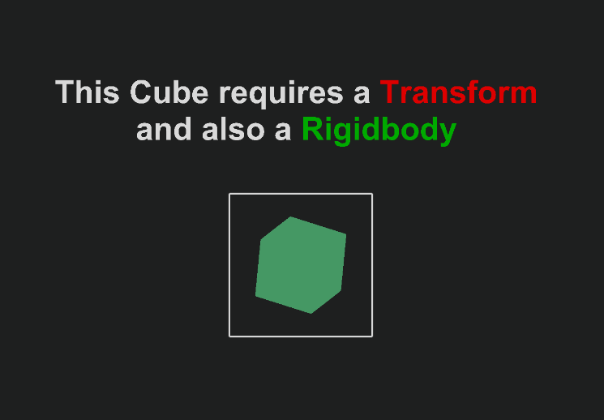
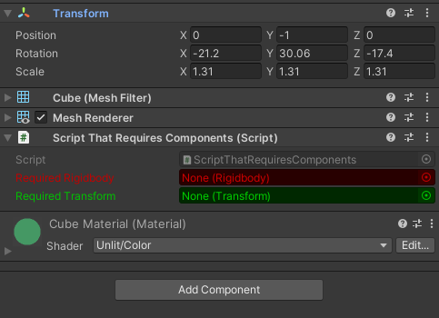
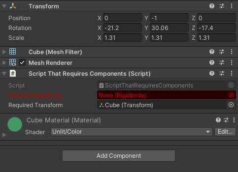

# Required Component Attribute

### A short Unity Editor extension that reminds you of missing required references!

When working with Unity, we quickly come across a notion: caching component references saves a lot of performance over using ` GetComponent() `. That's where this quick editor extension comes in.

I built this attribute to be used when in the debuging and testing stages of coding, to speed up our workflow as programmers who constantly forget to link references when building a new component, or when adding a component to an existing Game Object.

  

